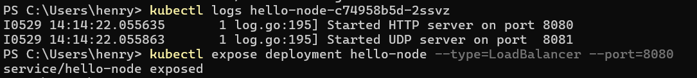
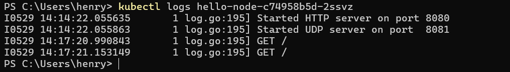

# Module 11 Kubernetes
**Nama:**   Henry Aditya Kosasi 
**NPM:**    2306214990 
**Kelas:**  Adpro A 

### Reflection on Hello Minikube
1. **Compare the application logs before and after you exposed it as a Service. Try to open the app several times while the proxy into the Service is running. What do you see in the logs? Does the number of logs increase each time you open the app?**

 
Sebelum aplikasi diekspos sebagai sebuah Service, log aplikasi tidak menunjukkan adanya aktivitas HTTP request yang masuk. Hal ini terjadi karena aplikasi belum bisa diakses dari luar pod, sehingga tidak ada traffic yang tercatat. Namun setelah pod diexpose melalui sebuah Service, setiap kali aplikasi dibuka melalui proxy, log mulai mencatat permintaan HTTP yang masuk. Jumlah log juga bertambah setiap kali aplikasi diakses, menandakan bahwa traffic eksternal sudah berhasil diteruskan ke pod. Ini menunjukkan bahwa Service di Kubernetes berperan penting dalam membuka akses ke aplikasi sekaligus memberikan visibilitas terhadap interaksi pengguna melalui log.

2. **Notice that there are two versions of `kubectl get` invocation during this tutorial section. The first does not have any option, while the latter has `-n` option with value set to `kube-system`. What is the purpose of the `-n` option and why did the output not list the pods/services that you explicitly created?**  
Opsi `-n` pada perintah `kubectl get` digunakan untuk menentukan **namespace** tempat Kubernetes mencari resource seperti pod, service, dan lainnya. Secara default, jika kita tidak menyebutkan `-n`, maka Kubernetes akan mencari resource di **namespace default**. Pada bagian awal tutorial, perintah tanpa `-n` digunakan untuk melihat resource yang kita buat sendiri, yang umumnya berada di namespace default. Sedangkan saat menggunakan `-n kube-system`, kita meminta Kubernetes untuk menampilkan resource yang berada di namespace **kube-system**, yaitu tempat komponen internal Kubernetes seperti CoreDNS, kube-proxy, dan lainnya berjalan. Oleh karena itu, ketika kita menjalankan perintah dengan `-n kube-system`, pod atau service yang kita buat sendiri tidak muncul, karena mereka berada di namespace yang berbeda.