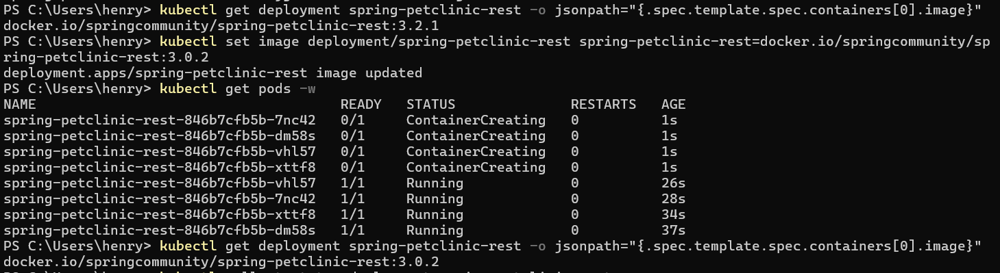

# Module 11 Kubernetes
**Nama:**   Henry Aditya Kosasi<br>
**NPM:**    2306214990<br>
**Kelas:**  Adpro A<br>

### Reflection on Hello Minikube
1. **Compare the application logs before and after you exposed it as a Service. Try to open the app several times while the proxy into the Service is running. What do you see in the logs? Does the number of logs increase each time you open the app?**


<br>
Sebelum aplikasi diekspos sebagai sebuah Service, log aplikasi tidak menunjukkan adanya aktivitas HTTP request yang masuk. Hal ini terjadi karena aplikasi belum bisa diakses dari luar pod, sehingga tidak ada traffic yang tercatat. Namun setelah pod diexpose melalui sebuah Service, setiap kali aplikasi dibuka melalui proxy, log mulai mencatat permintaan HTTP yang masuk. Jumlah log juga bertambah setiap kali aplikasi diakses, menandakan bahwa traffic eksternal sudah berhasil diteruskan ke pod. Ini menunjukkan bahwa Service di Kubernetes berperan penting dalam membuka akses ke aplikasi sekaligus memberikan visibilitas terhadap interaksi pengguna melalui log.

2. **Notice that there are two versions of `kubectl get` invocation during this tutorial section. The first does not have any option, while the latter has `-n` option with value set to `kube-system`. What is the purpose of the `-n` option and why did the output not list the pods/services that you explicitly created?**<br><br>
Opsi `-n` pada perintah `kubectl get` digunakan untuk menentukan **namespace** tempat Kubernetes mencari resource seperti pod, service, dan lainnya. Secara default, jika kita tidak menyebutkan `-n`, maka Kubernetes akan mencari resource di **namespace default**. Pada bagian awal tutorial, perintah tanpa `-n` digunakan untuk melihat resource yang kita buat sendiri, yang umumnya berada di namespace default. Sedangkan saat menggunakan `-n kube-system`, kita meminta Kubernetes untuk menampilkan resource yang berada di namespace **kube-system**, yaitu tempat komponen internal Kubernetes seperti CoreDNS, kube-proxy, dan lainnya berjalan. Oleh karena itu, ketika kita menjalankan perintah dengan `-n kube-system`, pod atau service yang kita buat sendiri tidak muncul, karena mereka berada di namespace yang berbeda.


### Reflection on Rolling Update & Kubernetes Manifest File
1. **What is the difference between Rolling Update and Recreate deployment strategy?**<br>
Perbedaan utama antara strategi **Rolling Update** dan **Recreate** terletak pada cara Kubernetes memperbarui pod saat ada perubahan pada deployment. Dengan strategi **Rolling Update**, Kubernetes akan memperbarui pod secara bertahap, yaitu beberapa pod lama dihentikan terlebih dahulu, baru pod baru dibuat secara bergiliran hingga semua pod menggunakan versi terbaru. Strategi ini memastikan bahwa aplikasi tetap tersedia selama proses update berlangsung sehingga cocok untuk aplikasi yang harus selalu online. Sementara itu, strategi **Recreate** akan menghentikan semua pod yang lama terlebih dahulu, lalu baru membuat pod baru dengan versi terbaru. Pendekatan ini lebih sederhana, tetapi menyebabkan downtime karena tidak ada pod yang berjalan selama proses pembaruan.


2. **Try deploying the Spring Petclinic REST using Recreate deployment strategy and document your attempt**<br>
    Berikut adalah langkah-langkah yang saya lakukan untuk mendemonstrasikan strategi Recreate pada deployment Spring Petclinic REST:
    1. **Modifikasi deployment.yaml**<br>
        Saya mengubah strategi deployment menjadi Recreate dengan mengedit bagian

        ```yml
        strategy:
            rollingUpdate:
                maxSurge: 25%
                maxUnavailable: 25%
            type: RollingUpdate
        ```
        menjadi

        ```yml
        type: Recreate
        ```
        (bagian rollingUpdate juga dihapus karena tidak boleh ada jika strategi Recreate digunakan)
    
    2. **Apply ulang konfigurasi baru**<br>
        Saya jalankan command berikut untuk menerapkan perubahan: `kubectl apply -f deployment.yaml`<br> (NOTE: untuk deployment-recreate.yaml saya perlu jalankan `minikube delete` dan `minikube start` terlebih dahulu karena tidak menghapus field seperti `resourceVersion`, `uid`, `creationTimestamp`, bagian `status`, `observedGeneration`, `readyReplicas`, dan `updatedReplicas`)

    3. **Ganti versi image untuk memicu update**<br>
        Saya mengganti versi container image dari 3.2.1 menjadi 3.0.2 dengan command: `kubectl set image deployment/spring-petclinic-rest spring-petclinic-rest=docker.io/springcommunity/spring-petclinic-rest:3.0.2`

    4. **Lihat status rollout**<br>
        Saya memastikan proses update selesai dengan command: `kubectl rollout status deployment spring-petclinic-rest`

    5. **Amati proses pod saat update**<br>
        Untuk melihat proses pod diganti, saya jalankan: `kubectl get pods -w`

    **Hasil Pengamatan**<br>
        Saat saya mengganti versi image, saya melihat bahwa keempat pod lama dihentikan terlebih dahulu, lalu keempat pod baru dibuat setelahnya. Ini berbeda dengan strategi RollingUpdate yang biasanya mengganti pod satu per satu.<br><br>
        
        <br><br>
        Ini membuktikan bahwa deployment menggunakan strategi Recreate, karena semua pod dihentikan dulu sebelum pod baru dijalankan, sehingga tidak ada dua versi yang running bersamaan seperti pada RollingUpdate.

3. **Prepare different manifest files for executing Recreate deployment strategy**<br>
    Saya menambahkan file manifest untuk recreate deployment dengan nama `deployment-recreate.yaml`

4. **What do you think are the benefits of using Kubernetes manifest files? Recall your experience in deploying the app manually and compare it to your experience when deploying the same app by applying the manifest files (i.e., invoking `kubectl apply -f` command) to the cluster.**<br>
    Menggunakan file manifest Kubernetes sangat membantu dalam proses deployment aplikasi karena semua konfigurasi dapat ditulis dan disimpan dalam satu berkas YAML. Pengalaman saya saat menggunakan `kubectl apply -f` terasa jauh lebih efisien dan terstruktur dibandingkan harus menulis banyak perintah secara terpisah. Dengan manifest, saya bisa mengatur deployment, service, strategi update, dan pengaturan lainnya hanya dengan satu perintah. Selain itu, file ini mudah untuk dikelola, diubah, dan dilacak versinya jika menggunakan sistem kontrol versi seperti Git. Manifest juga sangat berguna untuk otomatisasi, sehingga proses deployment bisa dilakukan dengan cara yang lebih konsisten dan dapat diulang kapan saja dengan mudah.

